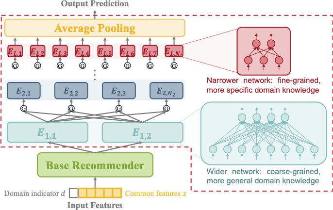
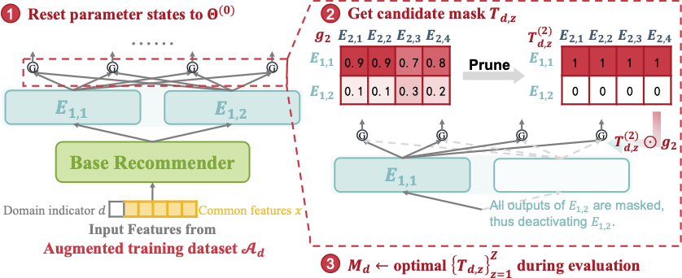
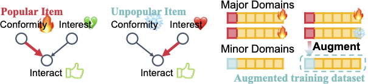

# AREAD - One for Dozens: Adaptive REcommendation for All Domains with Counterfactual Augmentation

This is the official implementation of the AREAD model in our paper: **One for Dozens: Adaptive REcommendation for All Domains with Counterfactual Augmentation**, which has been accepted at AAAI 2025. :sparkles: 
- :page_facing_up: [Extended Version (arXiv, **recommended**)](https://arxiv.org/abs/2412.11905)
- :page_facing_up: [Official Paper (AAAI)](https://ojs.aaai.org/index.php/AAAI/article/view/33340)  

If this repository or our paper is beneficial for your work, please cite:

```
Luo, H., Chen, Y., Wu, Y., Zhuang, F., & Wang, D. (2025). One for Dozens: Adaptive REcommendation for All Domains with Counterfactual Augmentation. Proceedings of the AAAI Conference on Artificial Intelligence, 39(12), 12300-12308. https://doi.org/10.1609/aaai.v39i12.33340
```

or in bibtex style:

```bibtex
@article{luo2025aread,
  title={One for Dozens: Adaptive REcommendation for All Domains with Counterfactual Augmentation},
  volume={39},
  url={https://ojs.aaai.org/index.php/AAAI/article/view/33340},
  DOI={10.1609/aaai.v39i12.33340},
  number={12},
  journal={Proceedings of the AAAI Conference on Artificial Intelligence},
  author={Luo, Huishi and Chen, Yiwen and Wu, Yiqing and Zhuang, Fuzhen and Wang, Deqing},
  year={2025},
  month={Apr.},
  pages={12300--12308}
}
```

## Introduction

Multi-domain recommendation (MDR) aims to enhance recommendation performance across various domains. However, real-world recommender systems in online platforms often need to handle dozens or even hundreds of domains, far exceeding the capabilities of traditional MDR algorithms, which typically focus on fewer than five domains. Key challenges include a substantial increase in parameter count, high maintenance costs, and intricate knowledge transfer patterns across domains. Furthermore, minor domains often suffer from data sparsity, leading to inadequate training in classical methods.

To address these issues, we propose Adaptive REcommendation for All Domains with counterfactual augmentation (AREAD). AREAD employs a hierarchical expert structure (HEI) and learns domain-specific expert network selection masks (HEMP) with counterfactual augmentation. Our experiments on two public datasets, each encompassing over twenty domains, demonstrate AREAD's effectiveness, especially in data-sparse domains.

<div align="center">
      
      <p><strong><figcaption>Figure 1:</strong> Hierarchical Expert Integration (HEI)</p>
</div>
<br>
            
<div align="center">
      
      <p><strong><figcaption>Figure 2:</strong> Hierarchical Expert Mask Pruning (HEMP)</p>
</div>
<br>
            
<div align="center">
      
      <p><strong><figcaption>Figure 3:</strong> Popularity-based Counterfactual Augmenter</p>
</div>
<br>

## Datasets

For our experiments, we utilize two widely recognized datasets: the **Amazon dataset** and the **AliCCP dataset**. Both datasets are structured around item categories, serving as distinct domains for our recommendation tasks. Sample data files are included in the repository folders (`dataset/aliccp` and `dataset/amazon`) to facilitate initial setup and verification. To perform full-scale training and harness the complete capabilities of AREAD, users are required to download the complete datasets from the provided links.

### Amazon Review Dataset

- **Download**: [Amazon Review Data (2018)](https://nijianmo.github.io/amazon/index.html).
- **Reference**: Ni, J., Li, J., McAuley, J. (2019). Justifying recommendations using distantly-labeled reviews and fine-grained aspects. In *Proceedings of EMNLP-IJCNLP 2019*, pages 188-197. 

### AliCCP Dataset

- **Download**: [AliCCP Dataset](https://tianchi.aliyun.com/dataset/408).
- **Reference**: Ma, X., Zhao, L., Huang, G., et al. (2018). Entire space multi-task model: An effective approach for estimating post-click conversion rate. In *SIGIR 2018*, pages 1137-1140. 

### Cloud-Theme Dataset

For those interested in testing recommendation algorithms across large-scale domains, the Cloud-Theme dataset may be a useful resource. This dataset includes over 1.4 million clicks across 355 distinct scenarios during a 6-day promotional period, supplemented by one month's purchase history of users before the promotion started. The label `clk_cnt` represents the number of times a user clicked on an item in the current session. Adapting this dataset for a common CTR task may require additional negative sampling techniques.

During the rebuttal phase of our paper, in response to reviewer comments, we conducted small-scale experiments using baseline models and our proposed AREAD on the Cloud-Theme dataset. Consequently, our repository includes preprocessing scripts for this dataset. We chose not to publish the experimental results as we have not yet performed comprehensive preprocessing and hyperparameter tuning on the dataset. Publishing these preliminary results without rigorous validation could compromise the fairness and integrity of our results.

- **Download**: [Cloud-Theme Dataset](https://tianchi.aliyun.com/dataset/9716).
- **Reference**:
  - Du, Z., Wang, X., Yang, H., Zhou, J., & Tang, J. (2019, July). Sequential scenario-specific meta learner for online recommendation. In *Proceedings of the 25th ACM SIGKDD International Conference on Knowledge Discovery & Data Mining* (pp. 2895-2904).
  - Li, W., Zhou, J., Luo, C., Tang, C., Zhang, K., & Zhao, S. (2024, October). Scene-wise Adaptive Network for Dynamic Cold-start Scenes Optimization in CTR Prediction. In *Proceedings of the 18th ACM Conference on Recommender Systems* (pp. 370-379).


## Run
You can run this model through:
```python
# Run directly with default parameters 
python main.py

# Run the model with a different dataset, specify the `dataset_name` parameter. 
python main.py --dataset_name amazon

# Run other models, specify the `model` parameter.
python main.py --model_name aread
```


## Related Repositories
We extend our gratitude to the following repositories, whose valuable resources have been instrumental in shaping our baseline and data processing code:

1. [Torch-RecHub](https://github.com/datawhalechina/torch-rechub): Comprehensive repository for recommendation systems, offering foundational code modules and dataset processing scripts.

2. [DeepCTR-Torch](https://github.com/shenweichen/DeepCTR-Torch): PyTorch implementation of [DeepCTR](https://github.com/shenweichen/DeepCTR), featuring an easy-to-use, modular, and extendable package of deep-learning based CTR models, including core components and multi-task learning algorithms. 

3. [FuxiCTR](https://github.com/reczoo/FuxiCTR): Offers a rich collection of models for CTR prediction, behavior sequence modeling, dynamic weight networks, and multi-task learning.

4. [SATrans](https://github.com/qwerfdsaplking/SATrans): Source code for paper "Scenario-Adaptive Feature Interaction for Click-Through Rate Prediction" (KDD 2023), offering useful single-domain and multi-domain/task models.

5. [HiNet](https://github.com/mrchor/HiNet): Source code for paper "HiNet: Novel Multi-Scenario & Multi-Task Learning with Hierarchical Information Extraction" (ICDE 2023), used as a baseline in our experiments.

## License

This project is licensed under the Apache License 2.0.  
See the [LICENSE](./LICENSE) file for details.

